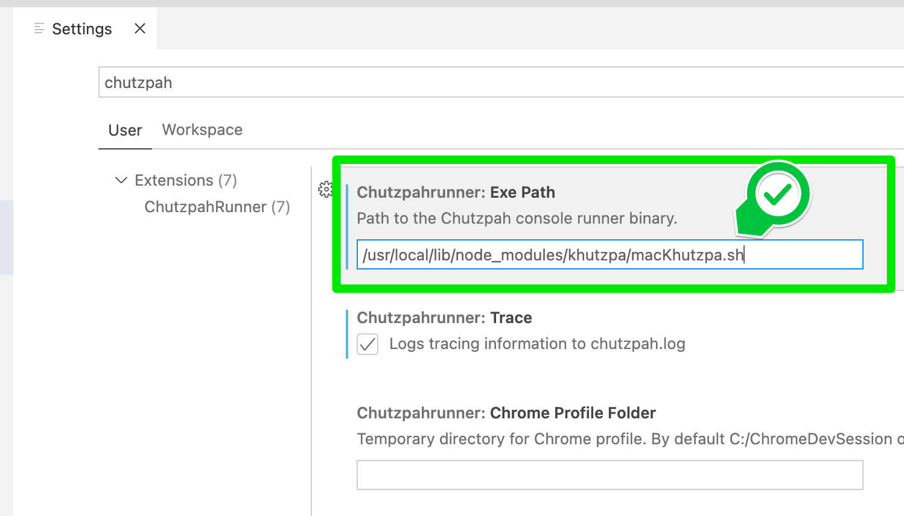

# khutzpa

Node powered, cross-platform, drop-in replacement for [Chutzpah.exe](http://mmanela.github.io/chutzpah/) that provides easy access to JavaScript testing with Jasmine and coverage reports with Istabul via karma and Jasmine (I think).

Look, this is an alpha I wrote between visits by the extended fam, in-laws, taxiing kids, etc. The code is hideous atm. It'll get better, if only because it hurts my eyes to look at right now. `(╯°□°）╯︵ ┻━┻  ;^D`

## Installation

`npm install khutzpa -g`

Yes, please install globally.

Note that Chutzpah (the original) has excellent Visual Studio integration, including an extension for VS 2019 and 2022.

Currently khutzpa (this pretender to the throne) *does not have a Visual Studio "Classic" extension*. 

khutzpa is designed to be run from the command line and/or using the [Chutzpah Runner for VS Code](https://marketplace.visualstudio.com/items?itemName=dfrencham.chutzpahrunner). More instructions below. Coolest part is that it works on macOS too. (Chutzpah.exe (duh, though yes, [mono](https://www.mono-project.com/docs/about-mono/supported-platforms/macos/), [maui](https://docs.microsoft.com/en-us/dotnet/maui/what-is-maui), I get it) does not.)

Note: I am hopeful we can steal the code to the VS Classic extension and swap out Chutzpah.exe with khutzpa and have an extension working, but I want this working in VS Code and my builds before we get VS Classic support rolling.


## Usage

The idea here is that you can use khutzpa as a drop-in replacement for Chutzpah, and it will digest the same Chutzpah.json configuration files that you had in your project already.

The difference is that khutzpa uses modern tools (see overly long description later). Yay!

The Chutzpah.json config files are described in detail [at the Chutzpah project](https://github.com/mmanela/chutzpah/wiki). We're going to support at least a subset of those.


### Examples from the command line

Run a single test file in the Jasmine standalone runner, served by a node webserver.

```
> khutzpa /usr/local/lib/node_modules/khutzpa/tests/fakeSite/ /openInBrowser
```

What the Chutzpah Runner probably would've sent:

```
> khutzpa /usr/local/lib/node_modules/khutzpa/tests/fakeSite/ /engine chrome /browserArgs --disable-web-security --user-data-dir=/Users/yourName/ChromeDevSession /openInBrowser /trace /debug
```

(Heads up! Most of the options the Runner sends aren't currently supported by khutzpa.)


Run an Istanbul test coverage report for every file in the directory `fakeTests`:

```
> khutzpa "/Applications/www/khutzpa/tests/fakeSite/fakeTests/" /coverage
```


### VS Code usage with Chutzpah Runner

#### macOS

This takes a little work. There are two ways to do this -- use the shell file that came with the install or make a new one somewhere you can access. Let's start with The Easy Way, use the one that came with your khutzpa install. We're going to hope it installed in the normal place, but if you're using nvm it might be somewhere else and these instructions won't work.

Okay, well, first I suppose you need to install the [Chutzpah Runner](https://marketplace.visualstudio.com/items?itemName=dfrencham.chutzpahrunner) extension in VS Code if you haven't.

If you haven't installed khutzpa globally, do that with (on macOS) `sudo npm install khutzpa -g`

Now open a Terminal and type this:

```
sudo chmod 755 /usr/local/lib/node_modules/khutzpa/macKhutzpa.sh
```

This allows us to use that file as if it were an application.

(**NOTE:** If you receive a message saying "No such file or directory", you probably have npm global installs in a nonstandard location. [Open an issue](https://github.com/ruffin--/khutzpa/issues) if you'd like and we can take a look.)

Now open VS Code. Hit `Cmd-,` to open your preferences. Search for `Chutzpah`.

In the entry for "Chutzpahrunner: Exe Path", enter that same file with its full path:

`/usr/local/lib/node_modules/khutzpa/macKhutzpa.sh`



Save settings and close the tab.

Now things should work! Right-click a file or folder in VS Code's Explorer and run some tests!

Note that khutzpa [purposefully] opens a new Terminal window ***that must be closed or the app quit*** before you can run it again. In the future, I may reuse the express server or have khutzpa check to see if the port it wants to use is already in use. Probably the former.

---

One known limitation: Right now, the runner is sending a filename for the **coverage** output that khutzpa is ignoring. You can see this under [Chutzpah's command-line options](https://github.com/mmanela/chutzpah/wiki/Command-Line-Options).

The options, which you can view in VS Code's Output window, will look like this:

```
/coveragehtml /var/folders/ry/9v79xg1j7n9fzdfygqmb4q180000gp/T/coverage-4yOxQ2.html
```

Right now, khutzpa is ignoring that option and opening the coverage html separately.

Probably not a _huge_ deal, but do note that means you'll have two html files open in your browser with each coverage fun for now, one from the Chutzpah Runner & one from khutzpa, and the one from the Runner will be empty.


#### Windows

[will add after I test it out & add it]


#### Linux

[It might be a while before I set this up. Let me know if you do it! Should be reasonably straightforward.]


-----


### Currently supported options

**WARNING:** For now, we're, um, taking an "any option you want, [as long as it's black](http://oplaunch.com/blog/2015/04/30/the-truth-about-any-color-so-long-as-it-is-black/)" approach. We're supporting a stark subset of [command-line](https://github.com/mmanela/chutzpah/wiki/Command-Line-Options) and [config](https://github.com/mmanela/chutzpah/wiki/Chutzpah.json-Settings-File) options.


#### Currently supported command line options

On the command line, khutzpa currently at leaset partially supports these options:

* File path
    * This can be a directory or a single specific test file.
    * **Must be the first option**
* `/openInBrowser`
    * Can occur anywhere
    * Means we're running the Jasmine [stand](https://jasmine.github.io/pages/getting_started.html)-<a href="https://www.testingdocs.com/getting-started-with-jasmine-standalone/" style="color:orange">alone</a> test suite and serving the results in a browser.
* `/coverage`
    * Can occur anywhere
    * This is super lazy. You can have any color of coverage you want, as long as it's...
        * Run in Chrome (Chrome must be installed)
        * Is output to html
        * Is opened in your default browser using a utility server
            * currently even the server's port is static. I think it is or was 3000.


#### Currently supported Chutzpah.json options

While we're here, know that khutzpa is just like Chutzpah, and will take the file path command line option and find the closest Chutzpah.json file there or _further up_ in the folder hierarchy.

Links are to the Chutzpah project's help, which should carry over.

* [References](https://github.com/mmanela/chutzpah/wiki/references-setting)
* [Tests](https://github.com/mmanela/chutzpah/wiki/tests-setting)
* CodeCoverageIncludes - "The collection code coverage file patterns to include in coverage. These are in glob format. If you specify none all files are included."
* CodeCoverageExcludes - "The collection code coverage file patterns to exclude in coverage. These are in glob format. If you specify none no files are excluded."

For now, that's it. 

This is an alpha, after all. That said, khutzpa likely won't support all of them when we're "done" either. _That_ said, it's amazing how much just those options buy you.

Note that there's a sample `Chutzpah.json` file in the `test` folder.


## Background

### What's wrong with Chutzpah?

[Chutzpah](http://mmanela.github.io/chutzpah/) was/is a command-line wrapper for running Jasmine testing and [Blanket](https://github.com/alex-seville/blanket) test coverage tools for JavaScript projects.

The good thing about Chutzpah is that it's a wrapper and it's exceptionally easy to set up even without knowledge of the tools it uses.

The bad thing about Chutzpah is that it's a wrapper and if the tools it's wrapped go stale, it's insanely difficult to update them.

Unfortunately, [the tools are too damn stale](https://www.youtube.com/watch?v=79KzZ0YqLvo). Blanket hasn't been updated (outside of its license) since 2016 and it doesn't support es6 well. Chutzpah's embedded version of Jasmine isn't much better (it is a _little_ better. `;^)`).

You can learn more about those issues at the [Chutzpah project](https://github.com/mmanela/chutzpah/issues?q=blanket+is%3Aissue+). Here's [one](https://github.com/mmanela/chutzpah/issues/789):

> Coverage does not work on anything but phantom.js and there are no plans to fix that since the library coverage is built on is deprecated so it would require a total rewrite.

Let's fix that.

-------

### How do we fix it?

[Section to be filled in as we leave alpha or beta or version 12 or something.]

[The TL;DR is that we're using modern tools. Jasmine standalone has been upated. We're using karma and istanbul-lib-coverage for coverage, etc etc. We're no longer using [PhantomJS](https://github.com/ariya/phantomjs/issues/15344) to run headless tests (so we can use es6 and up!) and are using Chrome [and only Chrome for now]. You get the point.]


----

# Acknowledgements 

As of 9 June 2022...

* [MIT License](https://opensource.org/licenses/MIT)
    * [Jasmine & Jasmine standalone](https://github.com/jasmine/jasmine/blob/main/MIT.LICENSE)
    * [karma](https://github.com/karma-runner/karma/blob/master/LICENSE)
* [Apache 2.0 License](https://opensource.org/licenses/Apache-2.0)
    * [Chutzpah](https://github.com/mmanela/chutzpah/blob/master/License.txt)
        * Note that not we're really using any code from there, but the "inspiration" is clear. 
        * [Hopefully stealing the wrapper from the VS Classic extension at some point.]
* [New BSD License](https://opensource.org/licenses/BSD-3-Clause)
    * [Istanbul](https://github.com/istanbuljs/istanbuljs/blob/c7693d4608979ab73ebb310e0a1647e2c51f31b6/packages/istanbul-lib-coverage/index.js#L2)

Each of these may include other dependencies in their package.json requirements. Please review each project for further details.